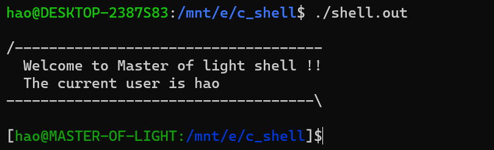
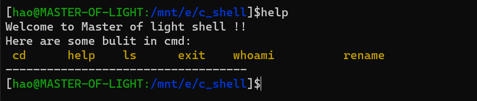
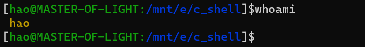
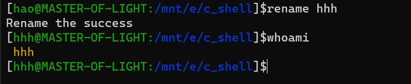
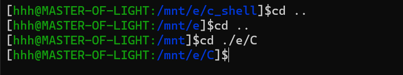
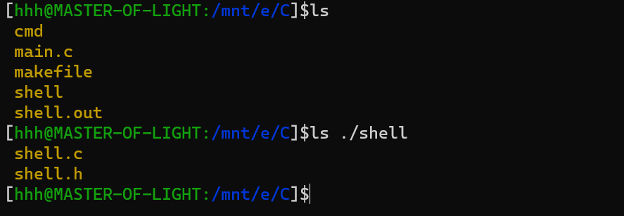

# 引言

> 本项目是跟着b站up主 [克拉克黎明之前](https://space.bilibili.com/251474603) 做的一个视频写的，在他的基础上添加了: **ls、whoami、rename** 命令

# 效果展示

## 欢迎界面


## 查看支持命令


## 查看当前用户


## 修改用户名


## 切换路径


## 列出所有文件


> 目前只实现了上述这些~

# 编译、运行

``` bash
make
./shell.out
```
